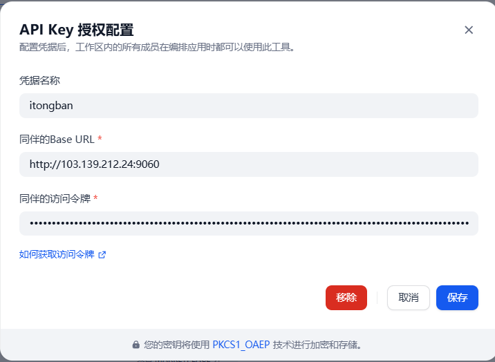
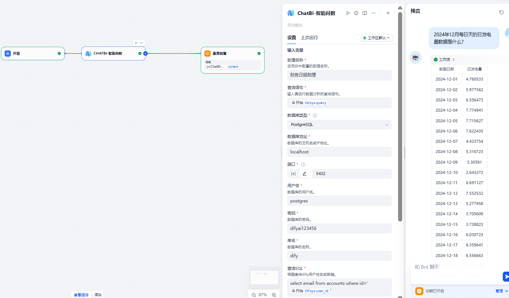

## 同伴ChatBI

**Author:** guojingi
**Version:** 0.0.1
**Type:** tool

### 概述
同伴ChatBI提供了一个工具：ChatBI-智能问数，可以实现以自然语言对话的方式访问您的数据。


下面将介绍如何配置和示例演示。

### 1.申请同伴访问令牌

如果您还没有同伴，请在同伴网站上注册申请。


登录到同伴。单击“管理”>“访问令牌”>“新增访问令牌”，以创建新令牌并获取令牌值。


如果您有同伴的私有部署环境，则可以在自己的环境中获取Token。

### 2.在Dify中填写配置

从Marketplace安装同伴ChatBI，并在授权页面中填写令牌和基地址。Token是在上一步中获得的值。

如果您有同伴私有部署环境，则基地址就是您的环境基地址。



### 3.使用工具

1. 引入 ChatBI_智能问数 插件
2. 完成基础参数配置

| 参数名         | 类型         | 必填 | 描述                           |
| -------------- | ------------ | ---- | ------------------------------ |
| assistant_name | string       | 是   | 同伴中配置的ChatBI助理名称     |
| query          | string       | 是   | 想要查询数据内容的自然语言     |
| db_type        | select       | 是   | 数据库类型（MySQL/PostgreSQL） |
| db_host        | string       | 是   | 数据库主机地址                 |
| db_port        | number       | 是   | 数据库端口                     |
| db_username    | string       | 是   | 数据库用户名                   |
| db_password    | secret-input | 是   | 数据库密码                     |
| db_name        | string       | 是   | 数据库库名                     |
| query_sql      | string       | 是   | 查询dify用户姓名或邮箱的SQL    |

3. ChatBI助理的配置需要在同伴中进行配置预处理，详见[同伴操作手册](https://doc.saasbi.itongban.com)


**示例**




**输出示例**

```
{
  "text": "| 数据日期 | 日发电量 |\n|:---:|:---:|\n| 2024-12-01 | 4.760533 |\n| 2024-12-02 | 5.977562 |\n| 2024-12-03 | 6.556473 |\n| 2024-12-04 | 7.774941 |\n| 2024-12-05 | 7.715627 |\n| 2024-12-06 | 7.622435 |\n| 2024-12-07 | 4.423754 |\n| 2024-12-08 | 5.316723 |\n| 2024-12-09 | 5.30591 |\n| 2024-12-10 | 2.643272 |\n| 2024-12-11 | 6.691127 |\n| 2024-12-12 | 7.552532 |\n| 2024-12-13 | 5.277958 |\n| 2024-12-14 | 3.705609 |\n| 2024-12-15 | 3.738823 |\n| 2024-12-16 | 6.030723 |\n| 2024-12-17 | 6.359641 |\n| 2024-12-18 | 6.556663 |\n| 2024-12-19 | 7.339836 |\n| 2024-12-20 | 1.723461 |\n| 2024-12-21 | 5.122004 |\n| 2024-12-22 | 3.636538 |\n| 2024-12-23 | 7.994277 |\n| 2024-12-24 | 6.048009 |\n| 2024-12-25 | 6.963684 |\n| 2024-12-26 | 5.877913 |\n| 2024-12-27 | 7.007194 |\n| 2024-12-28 | 3.65698 |\n| 2024-12-29 | 4.439459 |\n| 2024-12-30 | 1.827672 |\n| 2024-12-31 | 7.768858 |\n",
  "files": [],
  "json": [
    {
      "queryResults": [
        {"statistical_date": "2024-12-01","日发电量": 4.760533},{"statistical_date": "2024-12-02","日发电量": 5.977562},{"statistical_date": "2024-12-03","日发电量": 6.556473},{"statistical_date": "2024-12-04","日发电量": 7.774941},{"statistical_date": "2024-12-05","日发电量": 7.715627},{"statistical_date": "2024-12-06","日发电量": 7.622435},{"statistical_date": "2024-12-07","日发电量": 4.423754},{"statistical_date": "2024-12-08","日发电量": 5.316723},{"statistical_date": "2024-12-09","日发电量": 5.30591},{"statistical_date": "2024-12-10","日发电量": 2.643272},{"statistical_date": "2024-12-11","日发电量": 6.691127},{"statistical_date": "2024-12-12","日发电量": 7.552532},{"statistical_date": "2024-12-13","日发电量": 5.277958},{"statistical_date": "2024-12-14","日发电量": 3.705609},{"statistical_date": "2024-12-15","日发电量": 3.738823},{"statistical_date": "2024-12-16","日发电量": 6.030723},{"statistical_date": "2024-12-17","日发电量": 6.359641},{"statistical_date": "2024-12-18","日发电量": 6.556663},{"statistical_date": "2024-12-19","日发电量": 7.339836},{"statistical_date": "2024-12-20","日发电量": 1.723461},{"statistical_date": "2024-12-21","日发电量": 5.122004},{"statistical_date": "2024-12-22","日发电量": 3.636538},{"statistical_date": "2024-12-23","日发电量": 7.994277},{"statistical_date": "2024-12-24","日发电量": 6.048009},{"statistical_date": "2024-12-25","日发电量": 6.963684},{"statistical_date": "2024-12-26","日发电量": 5.877913},{"statistical_date": "2024-12-27","日发电量": 7.007194},{"statistical_date": "2024-12-28","日发电量": 3.65698},{"statistical_date": "2024-12-29","日发电量": 4.439459},{"statistical_date": "2024-12-30","日发电量": 1.827672},{"statistical_date": "2024-12-31","日发电量": 7.768858}],
      "textResult": "| 数据日期 | 日发电量 |\n|:---:|:---:|\n| 2024-12-01 | 4.760533 |\n| 2024-12-02 | 5.977562 |\n| 2024-12-03 | 6.556473 |\n| 2024-12-04 | 7.774941 |\n| 2024-12-05 | 7.715627 |\n| 2024-12-06 | 7.622435 |\n| 2024-12-07 | 4.423754 |\n| 2024-12-08 | 5.316723 |\n| 2024-12-09 | 5.30591 |\n| 2024-12-10 | 2.643272 |\n| 2024-12-11 | 6.691127 |\n| 2024-12-12 | 7.552532 |\n| 2024-12-13 | 5.277958 |\n| 2024-12-14 | 3.705609 |\n| 2024-12-15 | 3.738823 |\n| 2024-12-16 | 6.030723 |\n| 2024-12-17 | 6.359641 |\n| 2024-12-18 | 6.556663 |\n| 2024-12-19 | 7.339836 |\n| 2024-12-20 | 1.723461 |\n| 2024-12-21 | 5.122004 |\n| 2024-12-22 | 3.636538 |\n| 2024-12-23 | 7.994277 |\n| 2024-12-24 | 6.048009 |\n| 2024-12-25 | 6.963684 |\n| 2024-12-26 | 5.877913 |\n| 2024-12-27 | 7.007194 |\n| 2024-12-28 | 3.65698 |\n| 2024-12-29 | 4.439459 |\n| 2024-12-30 | 1.827672 |\n| 2024-12-31 | 7.768858 |\n"
    }
  ],
  "status": "success"
}
```

